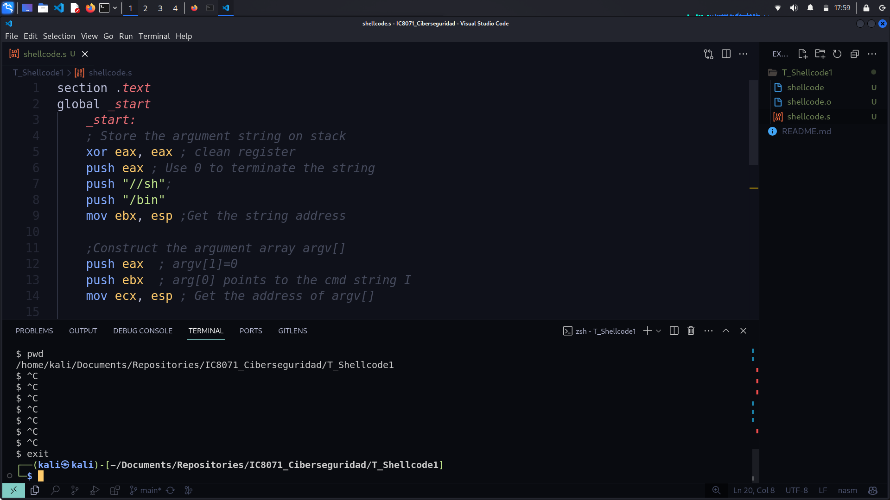
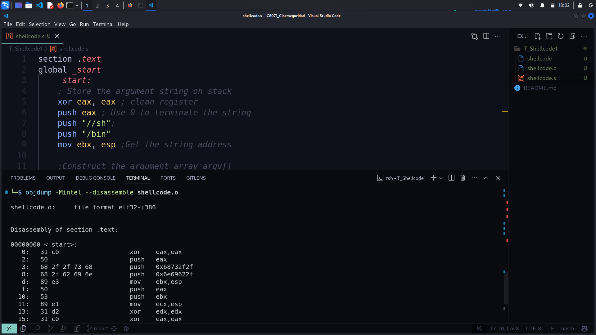
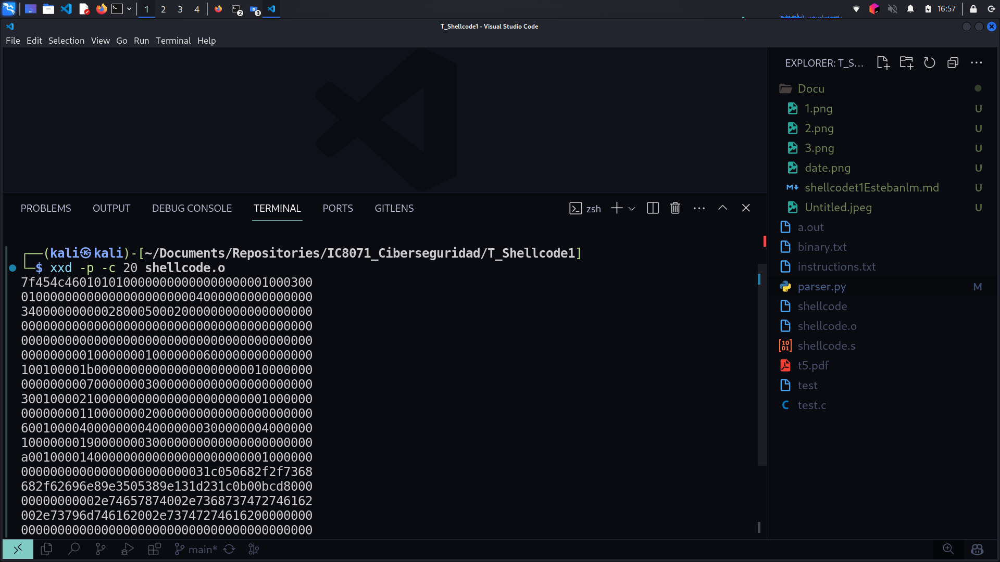
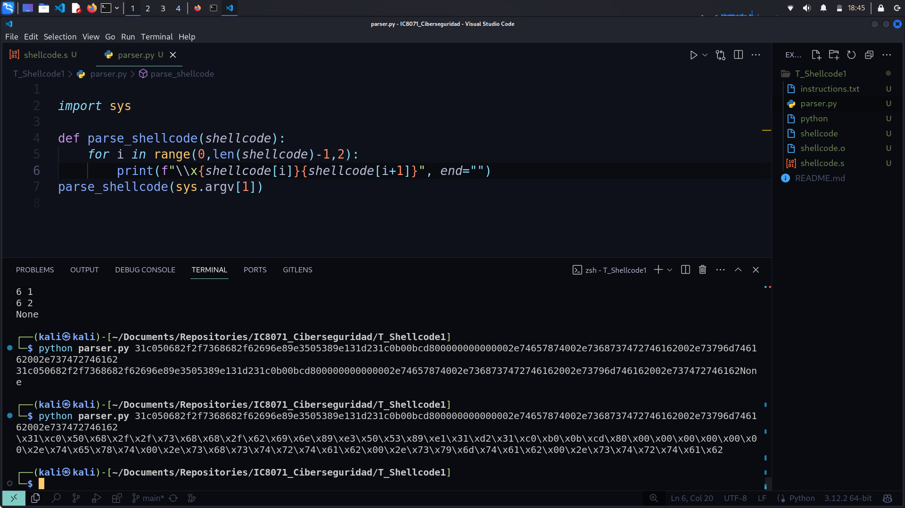
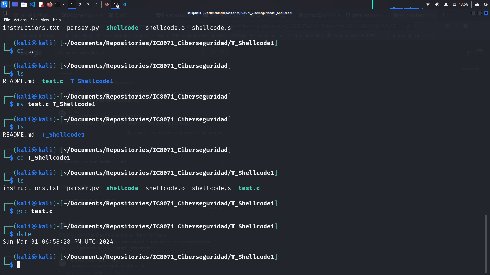
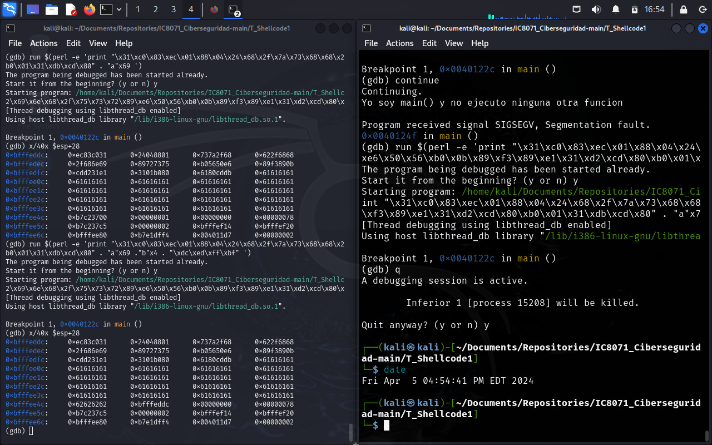

Esteban Leiva Montenegro 2020426227

# Escriendo el shellcode en asm

# Ejecutando el comando objdump

# Obteniendo el binario
> con el comando xxd -p -c 20 shellcode.o

# Parseando el binario en python


```python
import sys
def parse_shellcode(shellcode):
    for i in range(0,len(shellcode)-1,2):
        print(f"\\x{shellcode[i]}{shellcode[i+1]}", end="")
parse_shellcode(sys.argv[1])

```
> Nota: Noté que el sistema operativo kali linux muestra solo la hora ya que trabajé en un usb booteable pero con este comando tomé la fecha en la que trabajé ese día


# Testeando el shellcode 


